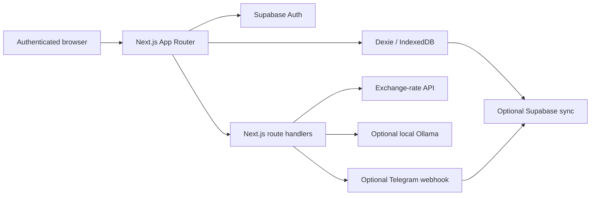

# TapTrack

TapTrack is a mobile-first personal finance tracker built around fast daily entry and local-first data access. The application stores its working finance data in IndexedDB through Dexie, adds an authenticated Next.js application shell through Supabase Auth, and can optionally mirror supported data to Supabase for cross-device recovery/sync.

The project is presented as a personal engineering application, not as a banking, accounting, investment, or financial-advice service.

## What it demonstrates

- **Command-first capture** for compact entries such as `-120 coffee cash`, including multi-entry parsing and preview before save.
- **Local-first persistence** with Dexie/IndexedDB as the client data source for transactions, balances, budgets, categories, conversions, recurring items, and settings.
- **Authenticated application shell** using Supabase Auth, with user-scoped remote tables available for optional sync.
- **Sync mechanics** including cursors, retry handling, delete tombstones, full replacement after reset/import, and manual sync status.
- **Finance workflows** for income/expenses, balance-aware transfers and currency conversions, monthly/category budgets, rollover, recurring transactions, and reports.
- **Export/import** through CSV and JSON plus lightweight PDF report export.
- **Optional integrations** for Telegram entry, server-fetched exchange rates, and local Ollama category suggestions.
- **PWA presentation** with install metadata, icons, a static-asset service worker, responsive navigation, dark mode, accessible feedback, and loading skeletons.
- **Release verification** with ESLint, TypeScript, Vitest, production build checks, dependency auditing, and route/API smoke tests in CI.

## Architecture



### Data boundary

TapTrack is **local-first**, not backend-free. The standard application shell uses Supabase Auth. Finance records are read and written locally through IndexedDB during normal browser use; configured sync can mirror supported records to user-scoped Supabase tables.

The current sync design is best-effort rather than a server-side durable job system. Telegram writes can reach Supabase directly and become visible to the browser after a pull sync. Recurring transactions are evaluated on app open rather than by a background scheduler.

## Implemented workflows

### Daily capture

- Expense and income commands.
- Multiple entries in one command.
- Manual transaction create/edit/delete.
- Category suggestions with deterministic fallback when Ollama is unavailable.
- Balance validation before destructive finance operations.

### Balances and conversions

- TRY, USD, and EUR balances.
- Cash/card methods.
- Currency exchange and cash/card transfers.
- Server-fetched exchange rates with fallback behavior.

### Budgets and recurring entries

- Monthly TRY budget.
- Category budgets.
- Rollover calculation.
- Recurring transaction CRUD.
- Due/missed recurring creation when the application opens.

### Reports and portability

- Monthly, custom-range, and yearly summaries.
- Optional TRY-unified reporting view.
- CSV and JSON export/import.
- Lightweight PDF report export.

## Technology

- **Next.js 16.2.12** App Router
- **React 19.2.8**
- **TypeScript**
- **Dexie / IndexedDB**
- **Supabase Auth + optional data sync**
- **Tailwind CSS**
- **Framer Motion**
- **Recharts**
- **Vitest**

Node.js **20.9+** is required; CI verifies the project on Node 22.

## Local setup

Install the locked dependency graph:

```bash
npm ci
```

Copy the environment template:

```bash
cp .env.example .env.local
```

On PowerShell:

```powershell
Copy-Item .env.example .env.local
```

At minimum, the standard authenticated application needs a Supabase project URL and anon key. Server-side sync/Telegram features additionally use the service-role key and integration-specific secrets. Ollama configuration is optional.

Start development:

```bash
npm run dev
```

## Environment variables

| Variable | Purpose | Required for |
|---|---|---|
| `NEXT_PUBLIC_SUPABASE_URL` | Supabase project endpoint | Authenticated app |
| `NEXT_PUBLIC_SUPABASE_ANON_KEY` | Browser-safe Supabase anon key | Authenticated app |
| `SUPABASE_SERVICE_ROLE_KEY` | Privileged server-side Supabase access | Telegram/server integration paths |
| `TELEGRAM_BOT_TOKEN` | Telegram Bot API credential | Telegram integration |
| `TELEGRAM_WEBHOOK_SECRET` | Validates Telegram/register webhook requests | Telegram integration |
| `TAPTRACK_OWNER_TELEGRAM_CHAT_ID` | Optional single-owner Telegram restriction | Telegram integration |
| `TAPTRACK_OWNER_USER_ID` | Maps Telegram writes to the configured Supabase user | Telegram integration |
| `OLLAMA_BASE_URL` | Local/controlled Ollama endpoint | Optional AI categorization |
| `OLLAMA_MODEL` | Ollama model name | Optional AI categorization |

Never expose the service-role key, Telegram token, or webhook secret to browser code or commit them to the repository.

## Verification

Run the main local ladder:

```bash
npm run lint
npm run typecheck
npm run test
npm run build
```

Or:

```bash
npm run check
```

After starting the production build with `npm run start`, route/API smoke checks can be run with:

```bash
npm run smoke:routes
```

The publication CI additionally runs:

```bash
npm audit --audit-level=high
npm audit --omit=dev --audit-level=high
```

The current audited publication branch uses an ESLint 10 compatibility wrapper for Next's plugins until those plugins natively support the ESLint 10 rule API.

## Current automated coverage

The verified suite contains **14 test files / 67 tests**. It covers core parser and finance services plus route-policy behavior, public integration exemptions, PWA assets, exchange-rate fallback behavior, Telegram authentication failures, category changes, report aggregation, export regressions, and sync side effects.

The production route smoke contains **8 checks** covering unauthenticated redirects, login/public assets, exchange-rate JSON behavior, and invalid Telegram secret handling.

## Security and privacy notes

- `.env*` files are ignored except the committed placeholder template.
- Supabase's service-role key and Telegram credentials are server-only secrets.
- The browser's IndexedDB database may contain sensitive personal finance information and should be treated accordingly on shared devices.
- Optional cloud sync changes the privacy boundary: configured records are then stored in the selected Supabase project.
- Telegram entry sends transaction commands through Telegram and the configured server route, so it is not equivalent to local-only entry.
- Ollama category suggestions are optional; the core workflow falls back when the model endpoint is unavailable.
- This repository is not a financial institution integration and does not connect directly to banks or payment networks.

See [`SECURITY.md`](SECURITY.md) for the publication/security boundary.

## Known limitations

- No bank/institution import or synchronization.
- No receipt/photo OCR or attachment workflow.
- No server-side durable sync queue.
- No background recurring scheduler or push-notification engine.
- PWA offline behavior is intentionally limited to static shell assets; IndexedDB remains the application data source.
- PDF export is intentionally lightweight rather than a full document-layout subsystem.
- Authenticated end-to-end browser coverage still requires a real disposable Supabase test session; automated route smoke currently verifies the unauthenticated/public boundary.

## Project documentation

- [`docs/PROJECT_STATE.md`](docs/PROJECT_STATE.md) — implementation and verification snapshot.
- [`docs/REPO_MAP.md`](docs/REPO_MAP.md) — repository/data-flow map.
- [`docs/DEPENDENCY_SECURITY_UPGRADE_PLAN.md`](docs/DEPENDENCY_SECURITY_UPGRADE_PLAN.md) — completed Next 16 security migration record.
- [`PUBLICATION.md`](PUBLICATION.md) — portfolio/publication checklist and supported claims.

## License

A public source-code license has **not yet been selected** for TapTrack. Do not change repository visibility to public until the owner chooses and adds the intended license.
