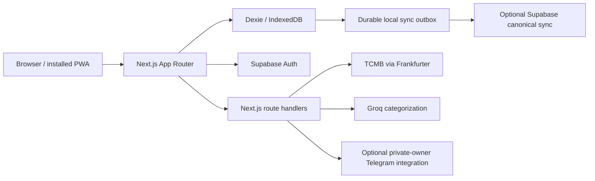

# TapTrack

TapTrack is a mobile-first, local-first personal finance tracker built around fast daily capture, deterministic ledger semantics, and optional account sync. Finance activity is written to IndexedDB through Dexie first; supported cloud sync mirrors canonical records to Supabase without making network availability a prerequisite for ordinary use.

TapTrack is a personal engineering application, not a banking, accounting, investment, tax, or financial-advice service.

## What it demonstrates

- **Multiple transaction-entry modes**: guided Quick Add, keyboard-first Command mode such as `-120 coffee cash`, and a detailed transaction editor.
- **Shortcut-friendly capture** through `/app/add`, validated deep-link prefills, and Android PWA manifest shortcuts.
- **Canonical ledger accounting** built from immutable opening checkpoints, reconciliation checkpoints, transactions, and conversions. Display balances are derived cache, not independent truth.
- **Offline-first mutation safety**: local finance writes and durable sync-outbox intents are committed atomically in IndexedDB; network delivery happens afterward and can retry.
- **Optional multi-device Supabase sync** with explicit cloud-vs-local adoption, durable retry state, soft deletes, deterministic recurring occurrence IDs, ledger generations, and last-successful-sync-wins conflict behavior for the same record.
- **Versioned backup/restore and reset semantics** with strict validation, pre-replacement safety backups, device-only detach flows, and generation-rotating account-wide replacement.
- **Historical foreign-exchange handling** using TCMB data via Frankfurter. Exchanges and TRY-unified reports use the selected/transaction date and fall back only to the most recent prior published rate.
- **Authenticated hosted AI categorization** using Groq server-side with server-only credentials and per-account quota enforcement.
- **Optional private-owner Telegram capture** through a fail-closed webhook backed by an atomic, idempotent PostgreSQL ledger-write RPC.
- **PWA/offline verification** covering mobile layouts, warmed offline navigation, offline Quick Add persistence, and service-worker behavior in Chromium.
- **Security hardening** including PKCE/email callback handling, Content Security Policy and related headers, dependency auditing, row-level data boundaries, and server-only privileged integrations.

## Architecture



### Ledger boundary

Opening and reconciliation checkpoints establish authoritative balance observations. Transactions and conversions after the latest applicable checkpoint are replayed to derive current balances. The `balances` table is a local derived cache and is not treated as independently synchronized truth.

Opening balances can be set only during initial setup. Later real-world balance corrections are recorded as reconciliation checkpoints and are excluded from ordinary income/expense analytics.

Historical activity entered on the same date as a reconciliation checkpoint asks whether it occurred before or after that checkpoint when ordering is otherwise ambiguous.

### Sync boundary

Sync is optional for finance records. A device must be explicitly bound to an authenticated Supabase account before finance data is mirrored.

When a device with local data links to an account that already contains cloud finance data, TapTrack requires an explicit choice between:

- **Use cloud data**: replace the device's canonical local ledger with the fetched cloud snapshot.
- **Merge this device**: preserve local records and enqueue them into the account before pulling the resulting cloud state.

Normal local finance mutations commit the canonical row and matching durable outbox operation in the same IndexedDB transaction. Failed network delivery leaves the outbox entry intact for later retry. Remote soft deletes propagate back to local state and balances are rebuilt from the canonical ledger afterward.

For conflicting edits to the same existing record, the last successful sync wins. Ledger generation metadata prevents stale pre-restore clients from silently writing into a replaced account ledger.

A linked browser can also explicitly **Disconnect this device**. That atomically removes the device binding and pending outbox while preserving the browser's canonical finance ledger and leaving the cloud account unchanged.

### Restore and reset boundary

Versioned JSON backup restore validates the complete replacement before mutation and creates a pre-restore safety backup.

On a linked device, restore has explicit scope:

- **Restore only this device**: detach the browser from cloud sync and restore locally.
- **Restore synced account**: replace the account ledger through the authenticated account-restore route, rotate the ledger generation, and preserve the local binding to the new generation.

Reset mirrors the same model:

- **Reset only this device**: create a safety backup, detach the browser, and replace only the local ledger with a fresh setup state.
- **Reset synced account everywhere**: create a safety backup, replace the canonical account ledger with a fresh state through the same generation-aware account replacement path, and allow linked devices to adopt the new generation.

### Offline/PWA boundary

TapTrack is designed to keep normal finance capture usable without a connection after the PWA shell has been installed/warmed. Service-worker registration is scoped to the authenticated application shell so an unauthenticated install cannot precache redirected login responses under `/app/*` routes.

Automated Chromium coverage verifies warmed offline navigation and an offline-created Quick Add transaction surviving reload at 320x720 and 390x844.

The repository does not claim equivalent native Safari/iOS installed-PWA verification yet. Native interactive widgets are also outside the current web build; `/app/add` provides the stable deep-link target for platform shortcuts such as Android launcher shortcuts and user-created iPhone Shortcuts/Back Tap/Action Button flows.

## Transaction capture

### Quick Add

Quick Add is the default on new devices. It is amount-first and keeps the common path short: type, amount, title, category, payment method, save. More details expose date, currency, and notes.

The selected Quick/Command entry mode is stored per device rather than synchronized across the account, so a desktop can remain keyboard-first while a phone stays touch-first.

### Command mode

Command mode remains available for power users and supports compact entries such as:

```text
-120 coffee cash
+20000 salary card
```

### Detailed editor

The Transactions workspace remains the full editor for historical records and detailed corrections. Quick Add, Command mode, the detailed editor, recurring generation, and deep-link capture all write through the same transaction/ledger services.

## Currency conversion and reporting

Currency exchange and cash/card transfers use the same canonical ledger service as transactions.

For cross-currency exchange, TapTrack calculates the destination amount from the source amount and selected date using TCMB rates exposed through the server-side Frankfurter integration. If the exact date has no published rate, the most recent prior published date is used. TapTrack does not substitute hard-coded or estimated fallback rates.

Reports support Month, Range, and Year views. By default they show TRY transactions only. **Convert all to TRY** values each USD/EUR transaction using its own transaction date, with the same prior-published-date rule. PDF export follows the selected report FX mode and uses the already-loaded historical-rate map so screen and export totals match.

Monthly budget performance remains a TRY-budget view even when report activity is converted to TRY.

## Budgets and recurring entries

- Monthly TRY budget and category budgets.
- Rollover support.
- Recurring income/expense rules.
- Deterministic occurrence IDs prevent the same recurring event from becoming duplicate transactions across devices.
- Monthly recurrence preserves the original day anchor, for example Jan 31 → Feb 28/29 → Mar 31.
- Yearly Feb 29 recurrence clamps to Feb 28 in non-leap years and returns to Feb 29 in leap years.
- Online startup pulls cloud state before generating due recurring entries; offline startup still generates locally.

## AI categorization

AI categorization is optional and requires a signed-in TapTrack account.

- Provider: **Groq**.
- Default model: `openai/gpt-oss-20b`.
- `GROQ_API_KEY` is server-only.
- The server validates the Supabase session before calling Groq.
- Input size and returned category values are validated.
- Per-account quota enforcement is stored in Supabase rather than process memory.
- Signed-out users retain local deterministic category suggestions without calling Groq.

The live TapTrack Supabase project has applied the server-only quota hardening migration: browser roles cannot execute the privileged quota RPC, while the authenticated application route verifies the user and consumes quota through the service-role client.

## Telegram integration

Telegram is optional and intentionally limited to one configured **private owner chat** for the current release design.

The webhook:

- fails closed when required Telegram, owner, timezone, or Supabase configuration is incomplete;
- validates Telegram's webhook secret;
- rejects non-owner chats and non-private chats;
- uses `TAPTRACK_TIME_ZONE` for the ledger date and `/today`;
- reads `/balance` from canonical ledger calculations rather than mutable balance blobs;
- writes transaction batches through `apply_taptrack_telegram_update` as one PostgreSQL operation;
- uses Telegram `update_id` for idempotency so retries do not create duplicate finance rows;
- escapes dynamic Telegram HTML and excludes soft-deleted rows.

The atomic database primitive and automated webhook tests are implemented. A final real-bot/disposable-account walkthrough remains part of release verification.

## Authentication and security

Supabase Auth powers the account layer. The callback route supports PKCE code exchange and token-hash verification for email confirmation flows.

Production-build responses include Content Security Policy, frame protection, `nosniff`, and referrer-policy headers, with route smoke assertions protecting those headers from accidental removal.

The current dependency baseline is audited in CI with zero vulnerabilities at the configured threshold.

## Technology

- **Next.js 16.3.4** App Router
- **React / React DOM 19.2.8**
- **TypeScript**
- **Dexie / IndexedDB**
- **Supabase Auth + optional canonical data sync**
- **Groq** for optional authenticated AI categorization
- **Tailwind CSS**
- **Framer Motion**
- **Recharts**
- **Vitest**
- **Playwright**

Node.js **22.x** is the supported runtime and is pinned in `package.json`/CI.

## Local setup

```bash
npm ci
cp .env.example .env.local
npm run dev
```

On PowerShell:

```powershell
Copy-Item .env.example .env.local
```

## Environment variables

| Variable | Purpose | Required for |
|---|---|---|
| `NEXT_PUBLIC_SUPABASE_URL` | Supabase project endpoint | Auth/account features and optional sync |
| `NEXT_PUBLIC_SUPABASE_ANON_KEY` | Browser-safe Supabase key | Auth/account features and optional sync |
| `SUPABASE_SERVICE_ROLE_KEY` | Privileged server-side Supabase access | Server-only sync/restore/integration paths |
| `GROQ_API_KEY` | Groq API credential | Authenticated AI categorization |
| `GROQ_MODEL` | Optional Groq model override | AI categorization; defaults to `openai/gpt-oss-20b` |
| `TELEGRAM_BOT_TOKEN` | Telegram Bot API credential | Optional private-owner Telegram integration |
| `TELEGRAM_WEBHOOK_SECRET` | Telegram webhook validation | Optional private-owner Telegram integration |
| `TAPTRACK_OWNER_TELEGRAM_CHAT_ID` | Allowed private Telegram chat | Optional private-owner Telegram integration |
| `TAPTRACK_OWNER_USER_ID` | Supabase user mapped to Telegram | Optional private-owner Telegram integration |
| `TAPTRACK_TIME_ZONE` | IANA timezone used for Telegram ledger dates | Optional private-owner Telegram integration |

Never expose `SUPABASE_SERVICE_ROLE_KEY`, `GROQ_API_KEY`, or Telegram secrets to browser code or commit them to the repository.

## Verification

Run the main local ladder:

```bash
npm run lint
npm run typecheck
npm run test
npm run build
```

Or:

```bash
npm run check
```

CI additionally performs the publication guard, full and production dependency audits, production route smoke, and offline mobile Playwright verification.

At B002 head `2e01cda7e69e80a4b75fa2bcea20f253fb4ebbc5`, GitHub Actions run `34206762454` passed the complete gate:

- dependency audits: 0 vulnerabilities;
- TypeScript: PASS;
- Vitest: **32 files / 172 tests PASS**;
- production build: PASS;
- route smoke: **9/9 PASS**;
- offline mobile Playwright: **2/2 PASS** at 320x720 and 390x844.

ESLint has no errors and currently reports three non-blocking `window.location.assign()` internal-navigation warnings used in offline fallback paths.

## Known limitations / release verification still required

- No bank or payment-network connection.
- No receipt/photo OCR or attachment workflow.
- Native interactive iOS/Android widgets are not implemented; current device integration uses PWA/deep-link shortcuts.
- Native installed Safari/iOS offline relaunch, upgrade, and storage-eviction behavior still needs dedicated verification.
- Empty-cloud inspection/binding is fail-closed and rechecked, but initial claim-and-seed is not one server-side transaction; a narrow TOCTOU residual remains.
- IndexedDB is not application-level encrypted.
- Supabase leaked-password protection is a dashboard-level setting and may depend on the project plan.
- The staged `20260908_enforce_protected_sync_writes.sql` migration must not be applied until the compatible remediation application is deployed.
- The final authenticated release walkthrough must use disposable/synthetic finance data and exercise multi-device sync, restore/reset, disconnect/relink, Telegram, and Groq.
- Native Safari/iOS behavior and final provider-backed release verification are not implied by the green Chromium CI gate.

## Privacy

IndexedDB may contain sensitive personal finance history. Anyone with access to the browser profile may be able to inspect that data; TapTrack does not provide application-level local database encryption.

Enabling Supabase sync stores supported canonical records in the configured project. Enabling Groq categorization sends the transaction title/category context required for classification through the authenticated server route to Groq. Enabling Telegram allows the configured private owner chat to create/read the supported finance context through the server webhook. Exchange-rate requests send currency/date pairs to the application's rate provider but not transaction titles or amounts.

## License

TapTrack is released under the **MIT License**. See [`LICENSE`](LICENSE).
